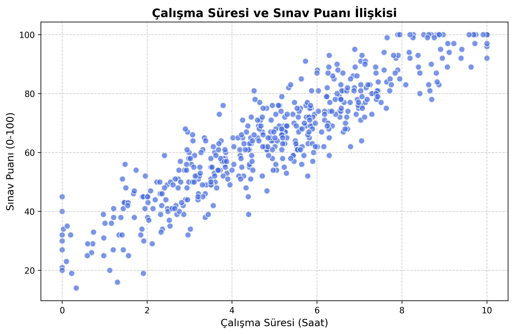
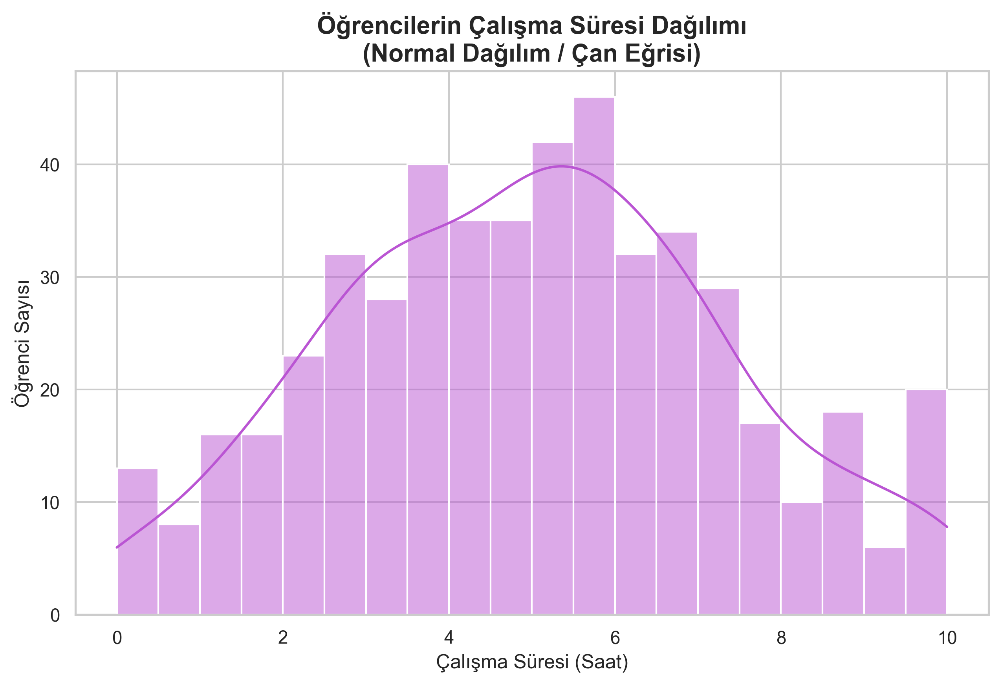

# Python ile Veri Üretimi ve Görselleştirme

Bu proje Python kullanılarak otomatik ve rastgele (normal dağılıma uygun) bir veri seti (`data.csv`) üretmek ve bu veriyi istatistiksel/interaktif olarak görselleştirmek amacıyla hazırlanmıştır. 

## 📊 1. Çalışma Süresi ve Sınav Puanı İlişkisi (Matplotlib)
Öğrencilerin çalışma saatlerinin (0-10 saat) sınav puanlarına (0-100 puan) olan genel etkisini gösteren saçılım grafiği (Scatter Plot):

## 🔔 2. Çalışma Süresi Dağılımı (Seaborn - Çan Eğrisi)
Öğrencilerin çalışma sürelerinin rastgele dağıtılırken yoğunluk olarak 5 saat civarında toplandığını kanıtlayan Normal Dağılım (Çan Eğrisi) grafiği:

## 🌐 3. Etkileşimli 3 Boyutlu Grafik (Plotly)
Repository içerisinde yer alan **`interaktif_3d.html`** dosyası, verileri üç farklı eksende (Saat, Puan, ID) değerlendiren ve fare ile çevrilebilen 3 boyutlu bir görselleştirmedir. 

> **Not:** GitHub, güvenlik nedeniyle HTML dosyalarını site üzerinde doğrudan 3D olarak çalıştırmaz (sadece kodunu gösterir). Bu interaktif grafiği tam ekran deneyimlemek için `interaktif_3d.html` dosyasını bilgisayarınıza indirip (Download) herhangi bir internet tarayıcısında (Chrome, Safari vb.) açabilirsiniz.

---
### 🛠 Kullanılan Teknolojiler
- **Pandas & Numpy**: CSV oluşturma, matematiksel dağılımlar ve veri işleme.
- **Matplotlib & Seaborn**: 2 Boyutlu sabit - istatistiksel grafik çizimleri.
- **Plotly**: 3 Boyutlu interaktif ağ ve uzay çizimleri.

- Bu sentetik veri seti, 500 farklı öğrencinin sınava hazırlık sürecini ve harcanan emeğin başarıya olan etkisini simüle eden kurgusal bir veri bilimi projesidir. Veri tabanının temelini oluşturan iki ana değişkenden ilki olan 'Calisma_Suresi', bir öğrencinin sınava hazırlanırken harcadığı toplam zamanı saat (0-10 saat) birimiyle temsil eder ve öğrencilerin büyük bir kısmının 5 saat aralığında çalıştığı varsayılarak istatistiksel bir normal dağılıma (çan eğrisine) uygun şekilde üretilmiştir. İkinci değişken olan 'Sinav_Puani' ise bu çalışma eforunun sonucunda elde edilen başarı notunu yüzdelik puan (0-100) birimiyle ifade eder. İki değişken arasındaki ilişki (çalışma süresi arttıkça puanın da genel olarak artması), gerçek hayattaki dış faktörleri (stres, şanssızlık veya öğrenme hızı farkları) taklit edebilmek adına sadece doğrusal bir şablonla değil, rastgele matematiksel sapmalar (gürültü) eklenerek kurgulanmıştır.
